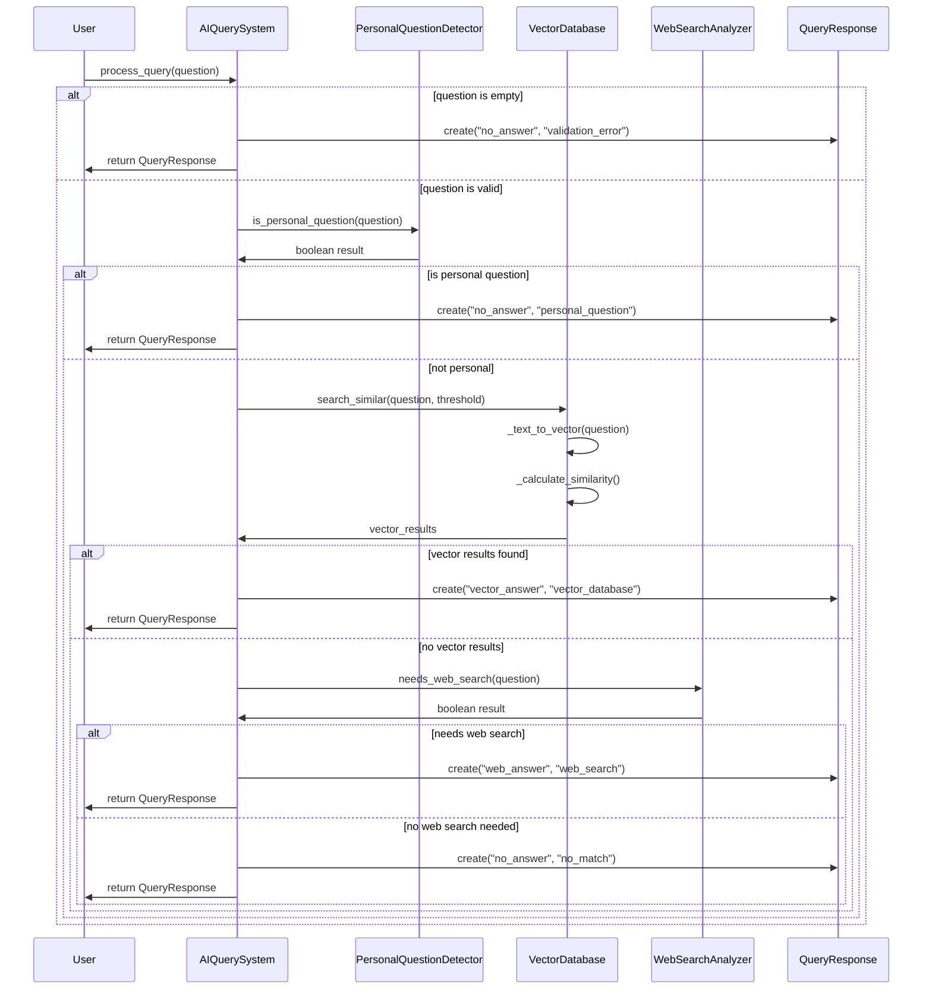
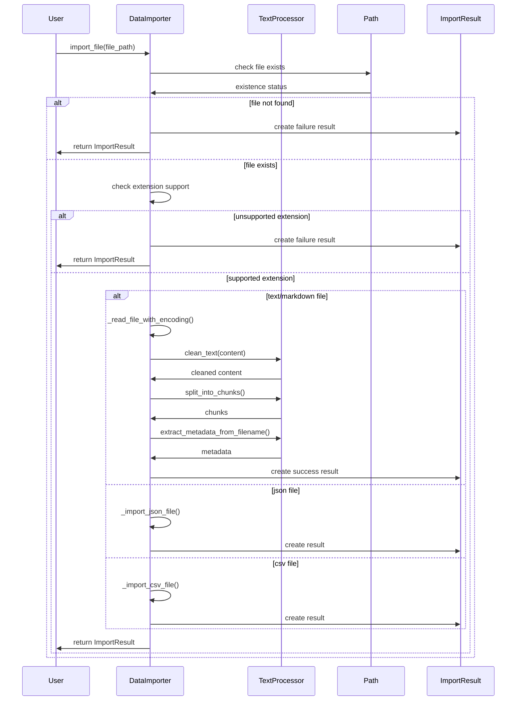
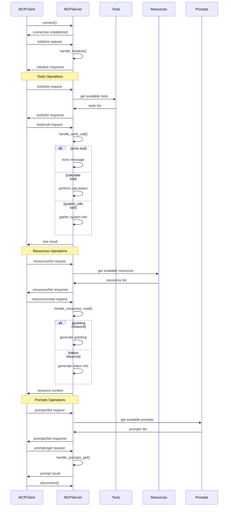

# Healthcare-AI System Diagrams

## Class Diagram

```mermaid
classDiagram
    %% Core AI System Classes
    class QueryResponse {
        +string message
        +string source
        +float confidence
        +string timestamp
        +__post_init__()
    }

    class VectorDatabase {
        +int dimension
        +List~List~float~~ vectors
        +List~Dict~ metadata
        +__init__(dimension: int)
        +add_data(text: str, category: str) bool
        +search_similar(query_text: str, threshold: float, top_k: int) List~Dict~
        -_text_to_vector(text: str) List~float~
        -_calculate_similarity(vec1: List~float~, vec2: List~float~) float
        +get_stats() Dict
    }

    class WebSearchAnalyzer {
        +List~str~ WEB_KEYWORDS
        +List~str~ TIME_INDICATORS
        +needs_web_search(query: str) bool
    }

    class PersonalQuestionDetector {
        +List~str~ PERSONAL_INDICATORS
        +List~str~ SUBJECTIVE_WORDS
        +is_personal_question(query: str) bool
    }

    class AIQuerySystem {
        +Dict RESPONSES
        +VectorDatabase vector_db
        +float vector_threshold
        +WebSearchAnalyzer web_analyzer
        +PersonalQuestionDetector personal_detector
        +__init__(vector_threshold: float)
        -_load_sample_data()
        +process_query(question: str) QueryResponse
        +add_knowledge(text: str, category: str) bool
        +get_system_info() Dict
        +search_knowledge(query: str, top_k: int) List~Dict~
    }

    %% Data Management Classes
    class ImportResult {
        +bool success
        +int items_imported
        +List~str~ errors
        +string file_path
        +__str__() string
    }

    class TextProcessor {
        +clean_text(text: str) string
        +split_into_chunks(text: str, chunk_size: int, overlap: int) List~str~
        +extract_metadata_from_filename(file_path: str) Dict~str, str~
    }

    class DataImporter {
        +Dict SUPPORTED_EXTENSIONS
        +List~str~ ENCODINGS
        +TextProcessor processor
        +__init__()
        +import_file(file_path: str, chunk_size: int) ImportResult
        -_import_text_file(file_path: str, chunk_size: int) ImportResult
        -_import_json_file(file_path: str) ImportResult
        -_import_csv_file(file_path: str) ImportResult
        -_read_file_with_encoding(file_path: str) Optional~str~
        +import_directory(directory_path: str, recursive: bool) List~ImportResult~
        +get_supported_formats() Dict~str, str~
    }

    %% MCP Server Classes
    class MCPServer {
        +string name
        +string version
        +bool initialized
        +Dict tools
        +Dict resources
        +Dict prompts
        +__init__(name: str, version: str)
        +create_response(request_id: Optional~int~, result: Any, error: Optional~Dict~) Dict
        +create_error(code: int, message: str, data: Any) Dict
        +handle_initialize(params: Dict) Dict
        +handle_tools_list(params: Dict) Dict
        +handle_tools_call(params: Dict) Dict
        +handle_resources_list(params: Dict) Dict
        +handle_resources_read(params: Dict) Dict
        +handle_prompts_list(params: Dict) Dict
        +handle_prompts_get(params: Dict) Dict
        +handle_request(request: Dict) Dict
        +read_message(reader: asyncio.StreamReader) Optional~Dict~
        +write_message(writer: asyncio.StreamWriter, message: Dict)
        +handle_client(reader: asyncio.StreamReader, writer: asyncio.StreamWriter)
        +start_server(host: str, port: int)
    }

    %% MCP Client Classes
    class MCPClient {
        +string host
        +int port
        +Optional~asyncio.StreamReader~ reader
        +Optional~asyncio.StreamWriter~ writer
        +bool connected
        +int request_id
        +Dict server_info
        +Dict capabilities
        +__init__(host: str, port: int)
        +next_id() int
        +connect() bool
        +disconnect()
        +send_request(method: str, params: Dict) Dict
        +read_message() Optional~Dict~
        +write_message(message: Dict)
        +initialize() Dict
        +list_tools() List~Dict~
        +call_tool(name: str, arguments: Dict) Dict
        +list_resources() List~Dict~
        +read_resource(uri: str) Dict
        +list_prompts() List~Dict~
        +get_prompt(name: str, arguments: Dict) Dict
    }

    class MCPClientDemo {
        +MCPClient client
        +__init__(client: MCPClient)
        +run_demo()
        +demo_tools()
        +demo_resources()
        +demo_prompts()
        +print_tool_result(tool_name: str, result: Dict)
        +print_resource_content(resource_name: str, result: Dict)
        +print_prompt_result(prompt_name: str, result: Dict)
    }

    %% Relationships
    AIQuerySystem --> VectorDatabase : uses
    AIQuerySystem --> WebSearchAnalyzer : uses
    AIQuerySystem --> PersonalQuestionDetector : uses
    AIQuerySystem --> QueryResponse : creates
    DataImporter --> TextProcessor : uses
    DataImporter --> ImportResult : creates
    MCPClientDemo --> MCPClient : uses
    VectorDatabase --> QueryResponse : returns data for
```



## AI Query System Action Diagram



## Data Import Action Diagram



## MCP Client-Server Communication Diagram



## System Integration Overview Diagram

```mermaid
flowchart TD
    User[👤 User] --> CLI{CLI Interface}
    
    CLI --> AIDemo[🤖 AI Demo Mode]
    CLI --> DataDemo[📁 Data Manager Mode]
    CLI --> MCPDemo[📡 MCP Demo Mode]
    
    AIDemo --> AISystem[AIQuerySystem]
    AISystem --> VectorDB[(VectorDatabase)]
    AISystem --> WebAnalyzer[WebSearchAnalyzer]
    AISystem --> PersonalDetector[PersonalQuestionDetector]
    
    DataDemo --> DataImporter[DataImporter]
    DataImporter --> TextProcessor[TextProcessor]
    DataImporter --> Files[(📄 Files)]
    
    MCPDemo --> MCPClient[MCPClient]
    MCPClient --> Network[🌐 Network]
    Network --> MCPServer[MCPServer]
    
    MCPServer --> Tools[🔧 Tools]
    MCPServer --> Resources[📄 Resources]  
    MCPServer --> Prompts[💡 Prompts]
    
    AISystem -.-> DataImporter : "can use imported data"
    DataImporter -.-> VectorDB : "can populate database"
    
    style User fill:#e1f5fe
    style AISystem fill:#f3e5f5
    style MCPServer fill:#e8f5e8
    style VectorDB fill:#fff3e0
    style Files fill:#fff3e0
